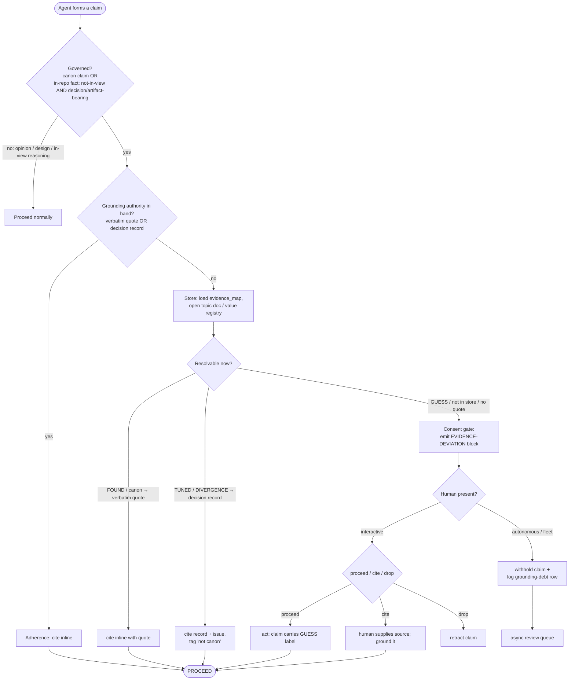

# Grounded-Claim Protocol — design spec

**Status:** DRAFT · grill-reviewed (#620) · **Date:** 2026-07-05 · **Author:** FIG (opus-4.8)
**Origin:** generalizes #571 (proactive PM-grounding) + #575 (detective gate) into a project-neutral
protocol. pycats is the first adopter. Prior findings:
`docs/research/2026-07-05-pm-mechanics-grounding-mechanism-571.md`.
**Critical review:** `2026-07-05-grounded-claim-protocol-grill.md` (#620) — five findings, all folded
in below; read it for the *why* behind the walked-back claims.

## Goal

Every claim in a *governed domain* is either **grounded in cited evidence** or **flagged as a
deviation the human consents to** — no silent guessing, no proxy-reasoning (asserting from a ticket
title, memory, or an unsourced doc instead of the primary evidence). Portable across projects via a
project-agnostic **protocol** + a per-project **config**.

Design decisions (from the brainstorming Q&A, refined by the grill):

| # | Decision | Rationale |
|---|---|---|
| Q1 | **Enforcement = structured self-report convention** (honor-system, in-band; no hooks) | Portable to any harness; accepted trade-off is "no hard teeth" — compensated by the #575 detective gate |
| Q2 | **Governed scope = external canon + in-repo facts**, with a **fast path** | Covers both real failures (ledge = canon, #363 = ticket-body); fast path keeps friction proportional to risk |
| Q3 | **Two stores by type + consistency check** | `provenance.py` (values) + by-category manifest (mechanics), tied by a cross-check test = the #575 gate; reflects pycats today, small change |

## Governed scope (precise — grill F4)

- **Canon claim** — any assertion about the external authority the project mirrors (pycats: Project M
  3.6 / Melee / Brawl mechanics + tuned game values).
- **In-repo fact** — a claim about code/tickets/tests, governed **only when BOTH**: (1) **not in
  view** (asserted from memory/inference, not a file being read *now*); **and** (2) **decision- or
  artifact-bearing** (feeds a commit, ticket, doc, classification, or closing summary). This is the
  **#363** shape — a v1 classification from a remembered title. Normal reasoning about an open file is
  fast-path, not gated.
- **Ungoverned** — opinions, design/UX judgment, transient working thoughts.

## Two grounding authorities (grill F1)

"Grounded" resolves to one of two checkable authorities — *not* a single quote bar:

- **Canon-grounded** (canon claims + `FOUND` values) → authority = a **verbatim primary quote**. The
  quote test applies: a source *name*/URL is not enough; you must hold the supporting **sentence**.
  (That quote lives in `pm-reference/` or the #535 register — **not** in `provenance.py`, whose
  `source` field is a reference, not a sentence.)
- **Decision-grounded** (`TUNED`/`DIVERGENCE`/pycats-invented) → authority = the **provenance record +
  deciding issue** (e.g. "TUNED, #543"). No canon quote exists by construction; the record *is* the
  authority. The claim must carry its **non-canon tag** but does not gate.
- **Neither** (no quote *and* no record) = the `GUESS` bucket = a **debt to drive to zero** (every
  governed value should end in one of the two authorities; cf. the #319 value-sourcing pass). A
  `GUESS`-basis claim **fires the gate**.

## Approach A — protocol + per-project manifest

**Protocol (generic, ships once):**
1. `grounded-claim` **skill** — the *procedure* (the claim lifecycle below).
2. **RULES line** — the *reflex*, always-loaded (Hardening #2): *"Read the source before asserting —
   body over title, primary over memory, registry over prose. Assert from a proxy → emit an
   evidence-deviation notice and get consent."* (Host TBD — see grill open nit: "Changing values" vs
   extending #562 vs its own line; decided at planning.)
3. **Deviation-block format** — the consent gate.
4. **Consistency-check test** — the #575 detective gate (two tiers; see Testing).
5. **The two grounding authorities + quote test** — above.

**Config (per-project, `.claude/evidence.json`):**
```json
{
  "canon": "Project M 3.6",
  "evidence_map": "docs/project-m-rules-by-category.md",
  "value_registry": "pycats/combat/provenance.py",
  "governed_domains": ["canon", "in-repo-fact"]
}
```
pycats already has the map, the registry, and the docs — adoption here is wiring, not building. A new
project writes its own `evidence.json` + map and the same skill works unchanged.

## Units (the decomplection)

Four units, each one job, communicating through a narrow interface so the store can be swapped
(pycats PM docs → any project's evidence base) without touching behavior or the gate.

| Unit | Job | Interface | pycats backing |
|---|---|---|---|
| **1. Store** | Hold sourced facts, each tagged | `lookup(topic) → {status, source, issue, …}` | `provenance.py` (values: `value/unit/source/status/issue/derivation`) + evidence_map manifest (mechanics). The **verbatim quote** for canon-grounding lives in `pm-reference/` / #535, *not* the registry. |
| **2. Router** | Surface the right doc at the right moment | `route(claim) → topic → Store.lookup` | evidence_map is the routing table |
| **3. Adherence** | Force cite-or-declare | `assert_or_declare(claim, basis) → cite-inline \| deviation-block` | `grounded-claim` skill + RULES line |
| **4. Consent gate** | Make deviation visible + consentable | `deviation-block → {proceed \| cite \| drop}` (interactive) / `withhold + log` (autonomous) | in-band message, no hook |

## Claim lifecycle

The path one governed claim takes. **The `basis` in hand decides the branch; the fast path (a grounding
authority already in hand → cite) skips the gate.** Canon claims need a *verbatim quote*; `TUNED`/
`DIVERGENCE` values need a *decision record*; a `GUESS`/none basis fires the gate.

### Mermaid



### Ditaa

```ditaa
    +-------------------------+
    |   Agent forms a claim   |
    +------------+------------+
                 |
                 v
        /--------------------\   no: opinion / in-view    +------------------+
        | Governed?          +------------------------->| Proceed normally |
        | canon OR in-repo   |                           | (ungoverned)     |
        | (not-in-view AND   |                           +------------------+
        |  decision-bearing) |
        \---------+----------/
                  | yes
                  v
        /----------------------\  yes   +------------------+
        | Grounding authority  +------>| Adherence:       |
        | in hand? (quote OR   |       | cite inline      |----+
        | decision record)     |       | (FAST PATH)      |    |
        \---------+------------/       +------------------+    |
                  | no                                        |
                  v                                           |
        +--------------------+                                |
        | Store: load map,   |                                |
        | open doc/registry  |                                |
        +---------+----------+                                |
                  |                                           |
                  v                                           |
        /--------------------\                                |
        | Resolvable now?    |                                |
        \-+-------+--------+-/                                 |
    FOUND |  TUNED |      | GUESS / not in store / no quote    |
    canon |  DIVERG|      |                                    |
    quote v  rec.  v      v                                    |
    +--------+ +--------+ +-------------------+                 |
    | cite   | | cite   | | Consent gate:     |                 |
    | +quote | | rec.+  | | emit EVIDENCE-    |                 |
    +---+----+ | tag    | | DEVIATION block   |                 |
        |      +---+----+ +---------+---------+                 |
        |          |                |                           |
        |          |                v                           |
        |          |        /---------------\                  |
        |          |        | Human present? |                  |
        |          |        \-+-----------+-/                    |
        |          |  interactive |       | autonomous/fleet     |
        |          |          v   |       v                      |
        |          |   +----------+--+ +------------------+       |
        |          |   | proceed/cite | | withhold claim + |       |
        |          |   | / drop       | | log debt row     |       |
        |          |   +------+-------+ +--------+---------+       |
        |          |          |                 |                 |
        v          v          v                 v                 v
    +=-----------------------------------+  +----------------+
    |              PROCEED               |  | async review   |
    +=-----------------------------------+  | queue          |
                                            +----------------+
```

**Legend.** *FOUND* = canon, backed by a verbatim quote. *TUNED / DIVERGENCE* = pycats decision,
backed by the registry record + issue — usable but the claim must carry a "not canon" tag. *GUESS* /
not-in-store / no-quote → the gate. Consent is in-band, never a blocking hook; in autonomous mode the
gate **withholds + logs** rather than blocking or proceeding silently (grill F3).

## Deviation-block format (the consent gate)

```
⚠️ EVIDENCE-DEVIATION
  claim:  <the assertion>
  domain: canon | in-repo
  basis:  memory | inference | unsourced-doc
  tag:    GUESS | UNKNOWN | contradicts-registry
  ask:    proceed / cite / drop?
```
- **Interactive:** the agent **waits** for a yes/no. `proceed` → the claim carries its `GUESS` tag into
  whatever it writes; `cite` → human supplies the source; `drop` → retract.
- **Autonomous/fleet (no human):** the gate is **halt-and-record**, never block-forever and never
  proceed-silently. The agent either grounds the claim or **withholds it and logs a grounding-debt
  row** for async review. **The deviation log = the async consent queue = the gate-fire tally store**
  (one store, not three).

## Failure modes & hardening (Murphy-jutsu pre-mortem)

### 🔴 High
- **Citation theater** (L:H·B:H) — a wrong claim with a real-*looking* source passes review a bare
  guess would fail (the ledge failure: doc cited #297 while asserting percent-scaling).
  → **Hardening #1: the quote test** (for canon-grounding). "Grounded" = a *verbatim supporting
  sentence*, not a URL. No sentence → synthesis → deviation.
- **Reflex eviction in long/fleet sessions** (context-rot, L:H·B:H) — a skill-description trigger
  scrolls off 150 turns later; the agent asserts from memory having never invoked it. This *is* the
  honor-system hole.
  → **Hardening #2: reflex in always-loaded RULES**, skill carries only the procedure. Backstop: the
  #575 detective gate. (High salience — don't bury it as a competing Nth bullet.)
- **Consent-fatigue → rubber-stamping** (L:M·B:H) — if the gate fires often, the human stamps
  reflexively and the check becomes theater.
  → **Hardening #3: gate-fire tally** (deferred — see Testing). The fast path must dominate; the gate
  stays rare. A tally makes fatigue *visible* — a high rate signals a mis-tuned trigger.

### 🟡 Medium
- **Wrong read of a correct source** (negation/caveat dropped, L:M·B:H) — the ledge *mechanism* (getup
  *speed* misread as intangibility *magnitude*). → Quote test catches it; scrutinize negations/tables/caveats.
- **Stale evidence** (L:M·B:M) — a row tagged FOUND whose research was later reversed (#536 reversed
  #538). → **Freshness metadata** (deferred — has not yet bitten; build on incident, not guessed need).
- **Grounding in unsourced prose** (L:M·B:M) — `pm-reference/` prose can itself be un-cited. → Ground
  in the *tagged* manifest/registry first; treat untagged prose as unverified; #575 Tier-2 lint.
- **Rule burial** (lost-in-the-middle, L:M·B:M) — an Nth critical rule gets skimmed. → High salience.

### 🟢 Low
- **Cross-session propagation** — one agent's GUESS becomes the next's "canon" via a doc; bounded by
  registry + #575 gate.
- **Complexity/maintenance rot** — the Tier-1 consistency test creates self-maintaining pressure; keep
  the protocol thin (see the MVP sequencing — grill F5).

### Accepted risks
- **Convention has no hard teeth** (Q1) — compensating control = #575 detective gate. Owner: human.
- **Generalization unproven** — validate on one non-pycats repo before claiming general.

## Testing / validation

- **Consistency-check test — #575, two tiers (grill F2):**
  - *Tier 1 (mechanizable, hard test):* per constant, manifest Status == registry `status`; a
    `TUNED`/`DIVERGENCE`/`GUESS` constant's manifest row can't present a canon primary-source. Catches
    **store-vs-store drift**. Extends `tests/test_tuning_provenance.py`. Joined by **constant name**
    (the manifest already names the constant).
  - *Tier 2 (audit, not a hard gate):* every PM-mechanic *sentence* in `pm-reference/` carries an
    inline tag or a manifest-row citation; a lint flags "canon-word near a mechanic/constant with no
    adjacent tag" for **human review** (false-positive-prone).
  - **Honest scope:** neither tier would have caught the ledge *prose* bug retroactively — the
    **proactive quote test at authoring time** (#571) is what prevents it. #575's value = drift-catch
    + enforcing the tagging convention.
- **Quote-test fixture set:** negations, tables, caveats — assert canon-grounding demands a complete
  supporting quote and flags a claim whose quote doesn't support it.
- **Gate-fire tally** *(deferred)* — a counter so consent-fatigue is measurable; build once the gate
  exists and fires enough to measure.
- **Freshness audit** *(deferred)* — surface manifest rows whose validation is stale; build on a real
  stale-evidence incident.

## Generalization

The **protocol** (skill, RULES line, deviation format, two-authority/quote test, consistency-test) is
repo-neutral — nothing says "Project M." The **config** (`evidence.json` + the map + the value registry
+ the docs) is per-project. Adopt elsewhere by installing the skill and writing that project's
`evidence.json` and evidence-map for its canon (a spec / RFC / standard / paper). **Validate on one
non-pycats repo before claiming general** (accepted-risk mitigation).

## Implementation decomposition (sequenced — grill F5; filed only on go-ahead)

Apply the protocol's own "no building on guessed need" rule to its roadmap:

1. **MVP (build now) — prevents both observed failures:**
   - **DEV:** `grounded-claim` skill + `.claude/evidence.json` schema (uses `skill-creator`), encoding
     the two grounding authorities + the governed-scope boundary.
   - **DECISION/DOCS:** the reflex RULES line (host per the open nit; extends #562's cite-primary rule).
2. **Next — detective:** the #575 consistency test (Tier-1 structured; Tier-2 lint audit).
3. **Deferred — evidence-gated fast-follows (do NOT build on guessed need):**
   - freshness metadata (until a stale-evidence incident occurs);
   - gate-fire tally (until the gate fires often enough to measure fatigue).

Relates to: #571 (closed, proactive findings), #575 (detective gate), #562 (cite-primary rule),
#535 (citation register), #536 (ledge audit).

## Out of scope
- Re-auditing `pm-reference/` prose content (#536 owns ledge; #535 owns the register).
- A hard-gate hook (declined in Q1; reserved if the convention proves leaky).
