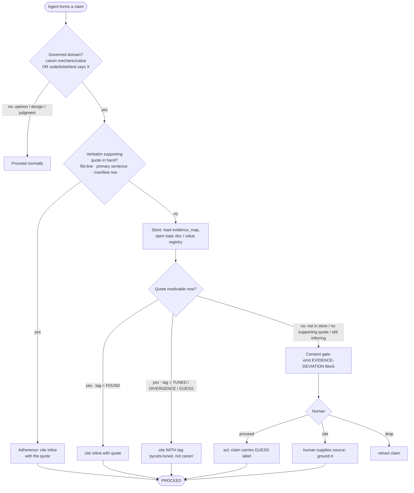

# Grounded-Claim Protocol — design spec

**Status:** DRAFT (brainstorming, pending user review) · **Date:** 2026-07-05 · **Author:** FIG (opus-4.8)
**Origin:** generalizes #571 (proactive PM-grounding) + #575 (detective gate) into a project-neutral
protocol. pycats is the first adopter. Prior findings:
`docs/research/2026-07-05-pm-mechanics-grounding-mechanism-571.md`.

## Goal

Every claim in a *governed domain* is either **grounded in cited evidence** or **flagged as a
deviation the human consents to** — no silent guessing, no proxy-reasoning (asserting from a ticket
title, memory, or an unsourced doc instead of the primary evidence). Portable across projects via a
project-agnostic **protocol** + a per-project **config**.

Design decisions (from the brainstorming Q&A):

| # | Decision | Rationale |
|---|---|---|
| Q1 | **Enforcement = structured self-report convention** (honor-system, in-band; no hooks) | Portable to any harness; accepted trade-off is "no hard teeth" — compensated by the #575 detective gate |
| Q2 | **Governed scope = external canon + in-repo facts**, with a **fast path** | Covers both real failures (ledge = canon, #363 = ticket-body); fast path keeps friction proportional to risk |
| Q3 | **Two stores by type + consistency check** | `provenance.py` (values) + by-category manifest (mechanics), tied by a cross-check test = the #575 gate; reflects pycats today, small change |

## Approach A — protocol + per-project manifest

**Protocol (generic, ships once):**
1. `grounded-claim` **skill** — the *procedure* (the claim lifecycle below).
2. **RULES line** — the *reflex*, always-loaded (see Hardening #2): *"Read the source before asserting
   — body over title, primary over memory, registry over prose. Assert from a proxy → emit an
   evidence-deviation notice and get consent."* Folded into the existing "Changing values" rule.
3. **Deviation-block format** — the consent gate.
4. **Consistency-check test template** — the #575 detective gate.
5. **The quote test** (Hardening #1) — "grounded" means *a verbatim supporting sentence in hand*, not
   a source name.

**Config (per-project, `.claude/evidence.json`):**
```json
{
  "canon": "Project M 3.6",
  "evidence_map": "docs/project-m-rules-by-category.md",
  "value_registry": "pycats/combat/provenance.py",
  "governed_domains": ["canon", "in-repo-fact"]
}
```
pycats already has the map, the registry, and the docs — adoption here is wiring, not building. A new
project writes its own `evidence.json` + map and the same skill works unchanged.

## Units (the decomplection)

Four units, each one job, communicating through a narrow interface so the store can be swapped
(pycats PM docs → any project's evidence base) without touching behavior or the gate.

| Unit | Job | Interface | pycats backing |
|---|---|---|---|
| **1. Store** | Hold sourced facts, each tagged | `lookup(topic) → {tag, quote, source, doc, const, last_validated, ticket}` | `provenance.py` (values) + evidence_map manifest (mechanics) |
| **2. Router** | Surface the right doc at the right moment | `route(claim) → topic → Store.lookup` | evidence_map is the routing table |
| **3. Adherence** | Force cite-or-declare | `assert_or_declare(claim, basis) → cite-inline \| deviation-block` | `grounded-claim` skill + RULES line |
| **4. Consent gate** | Make deviation visible + consentable | `deviation-block → {proceed \| cite \| drop}` | in-band message, no hook |

## Claim lifecycle

The path one governed claim takes. **The `basis` in hand decides the branch; the fast path (verbatim
supporting quote in hand → cite) skips the gate.** "Source in hand" means the *quote*, not a URL
(Hardening #1 — the quote test).

### Mermaid



### Ditaa

```ditaa
    +-------------------------+
    |   Agent forms a claim   |
    +------------+------------+
                 |
                 v
        /--------------------\   no: opinion/design    +------------------+
        | Governed domain?   +----------------------->| Proceed normally |
        | canon OR in-repo   |                         | (ungoverned)     |
        \---------+----------/                         +------------------+
                  | yes
                  v
        /----------------------\  yes   +------------------+
        | Verbatim supporting  +------>| Adherence:       |
        | quote in hand?       |       | cite inline      |----+
        \---------+------------/       | (FAST PATH)      |    |
                  | no                  +------------------+    |
                  v                                            |
        +--------------------+                                 |
        | Store: load map,   |                                 |
        | open doc/registry  |                                 |
        +---------+----------+                                 |
                  |                                            |
                  v                                            |
        /--------------------\                                 |
        | Quote resolvable?  |                                 |
        \-+-------+--------+-/                                  |
     FOUND |  TUNED |      | no: not in store / no quote        |
          |  DIVERG |      |     / still inferring              |
          v  GUESS  v      v                                   |
    +--------+ +--------+ +-------------------+                 |
    | cite   | | cite   | | Consent gate:     |                 |
    | inline | | +tag   | | emit EVIDENCE-    |                 |
    +---+----+ +---+----+ | DEVIATION block   |                 |
        |          |      +---------+---------+                 |
        |          |                |                           |
        |          |                v                           |
        |          |        /---------------\                  |
        |          |        |    Human?      |                  |
        |          |        \-+-----+-----+-/                   |
        |          |  proceed |  cite |   | drop                |
        |          |          v       v   v                     |
        |          |    +---------+ +----+ +----------+          |
        |          |    | act +   | |grnd| | retract  |          |
        |          |    | GUESS   | |it  | | claim    |          |
        |          |    +----+----+ +-+--+ +----------+          |
        |          |         |        |                          |
        v          v         v        v                          v
    +=------------------------------------------------------------=+
    |                          PROCEED                             |
    +=------------------------------------------------------------=+
```

**Legend.** *FOUND* = sourced to primary, treat as canon. *TUNED / DIVERGENCE / GUESS* = usable but
**not** canon — the claim must carry the tag. The gate fires only when no supporting quote can be
produced from the store; consent is in-band (a message you answer), never a blocking hook.

## Deviation-block format (the consent gate)

```
⚠️ EVIDENCE-DEVIATION
  claim:  <the assertion>
  domain: canon | in-repo
  basis:  memory | inference | unsourced-doc
  tag:    GUESS | UNKNOWN | contradicts-registry
  ask:    proceed / cite / drop?
```
Emitted only on the "no quote" branch; the agent then **waits** for a yes/no. `proceed` → the claim
carries its `GUESS` tag into whatever it writes; `cite` → human supplies the source; `drop` → retract.

## Failure modes & hardening (Murphy-jutsu pre-mortem)

Full register below; the four load-bearing hardening changes are folded into the design above.

### 🔴 High
- **Citation theater** (L:H·B:H) — a wrong claim with a real-*looking* source passes review that a
  bare guess would fail (the exact ledge failure: doc cited #297 while asserting percent-scaling).
  → **Hardening #1: the quote test.** "Grounded" = a *verbatim supporting sentence* in hand, not a URL.
  No supporting sentence → it's synthesis → deviation. Converts citation-presence into citation-content.
- **Reflex eviction in long/fleet sessions** (context-rot, L:H·B:H) — a skill-description trigger
  loaded at session start scrolls off / gets lost-in-the-middle 150 turns later; the agent asserts
  from memory having never invoked it. This *is* the honor-system hole.
  → **Hardening #2: reflex in always-loaded RULES**, skill carries only the procedure. Backstop:
  #575 detective gate. (Fold into the existing "Changing values" rule at high salience — do **not**
  add a competing 17th bullet that gets buried.)
- **Consent-fatigue → rubber-stamping** (L:M·B:H) — if the gate fires often, the human stamps
  reflexively and the check becomes theater.
  → **Hardening #3: gate-fire tally.** The fast path must dominate (cite inline = common case); the
  gate stays rare. A lightweight tally makes fatigue *visible* — a high rate signals a mis-tuned
  trigger, not a reason to stamp faster.

### 🟡 Medium
- **Wrong read of a correct source** (negation/caveat dropped, L:M·B:H) — the ledge *mechanism* (getup
  *speed* misread as intangibility *magnitude*). → Quote test catches it; scrutinize negations/tables/caveats.
- **Stale evidence** (L:M·B:M) — a row tagged FOUND whose research was later reversed (#536 reversed
  #538). → **Hardening #4: freshness metadata** — each manifest row carries `last_validated` +
  validating ticket; tags can be downgraded.
- **Grounding in unsourced prose** (L:M·B:M) — `pm-reference/` prose can itself be un-cited. → Ground
  in the *tagged* manifest/registry first; treat untagged prose as unverified; #575 consistency test.
- **Rule burial** (lost-in-the-middle, L:M·B:M) — a 17th critical rule gets skimmed. → Fold into an
  existing rule, high salience.

### 🟢 Low
- **Cross-session propagation** — one agent's GUESS becomes the next's "canon" via a doc; bounded by
  registry + #575 gate.
- **Complexity/maintenance rot** — the consistency test creates self-maintaining pressure; keep the
  protocol thin.

### Accepted risks
- **Convention has no hard teeth** (Q1 decision) — compensating control = #575 detective gate
  (proactive convention + detective audit together bound it). Owner: human.
- **Generalization unproven** — validate on one non-pycats repo before claiming general.

## Testing / validation

- **Consistency-check test (#575):** a value tagged `TUNED`/`DIVERGENCE`/`GUESS` in `provenance.py`
  may NOT be described as canon in the docs → test fails. This is the detective gate + the
  self-maintaining pressure that keeps stores in sync.
- **Quote-test fixture set:** negations, tables, and caveats — assert the protocol demands a complete
  supporting quote and flags a claim whose quote doesn't support it.
- **Gate-fire tally:** a counter (e.g. logged per session) so consent-fatigue is measurable.
- **Freshness audit:** surface manifest rows whose `last_validated` is older than a threshold
  (audit/report, not a hard fail).

## Generalization

The **protocol** (skill, RULES line, deviation format, quote test, consistency-test template,
gate-fire tally) is repo-neutral — nothing says "Project M." The **config** (`evidence.json` + the
map + the value registry + the docs) is per-project. Adopt elsewhere by installing the skill and
writing that project's `evidence.json` and evidence-map for its canon (a spec / RFC / standard / paper).
**Validate on one non-pycats repo before claiming general** (accepted-risk mitigation).

## Implementation decomposition (seeds — filed only on go-ahead)

This design implements as ~5 tickets; sequencing is the writing-plans step:
1. **DEV:** author the `grounded-claim` skill + `.claude/evidence.json` schema (uses `skill-creator`).
2. **DECISION/DOCS:** fold the reflex RULES line into "Changing values" (extends #562).
3. **DEV:** the consistency-check test — implements **#575**.
4. **DOCS:** add `last_validated` + validating-ticket columns to the evidence_map; backfill.
5. **DEV:** the gate-fire tally mechanism.

Relates to: #571 (closed, proactive findings), #575 (detective gate), #562 (cite-primary rule),
#535 (citation register), #536 (ledge audit).

## Out of scope
- Re-auditing `pm-reference/` prose content (#536 owns ledge; #535 owns the register).
- A hard-gate hook (declined in Q1; reserved if the convention proves leaky).
